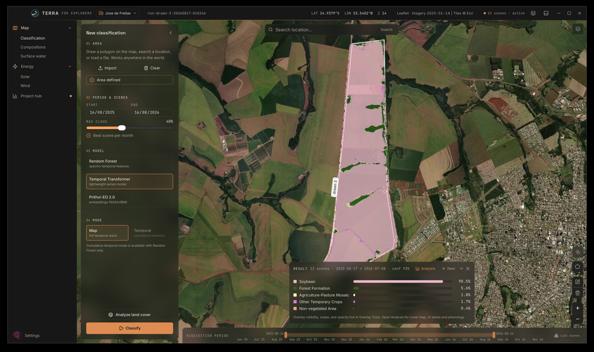
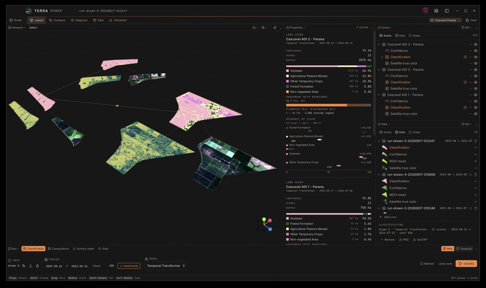
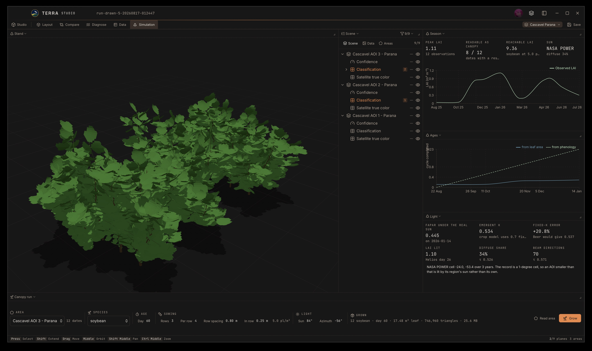
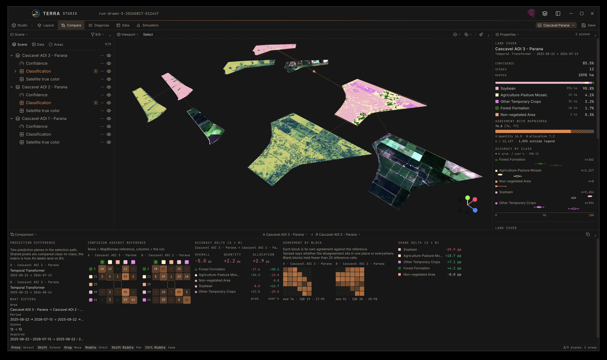
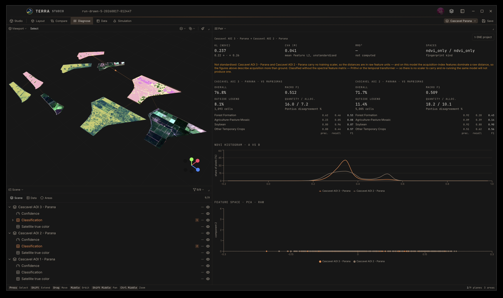
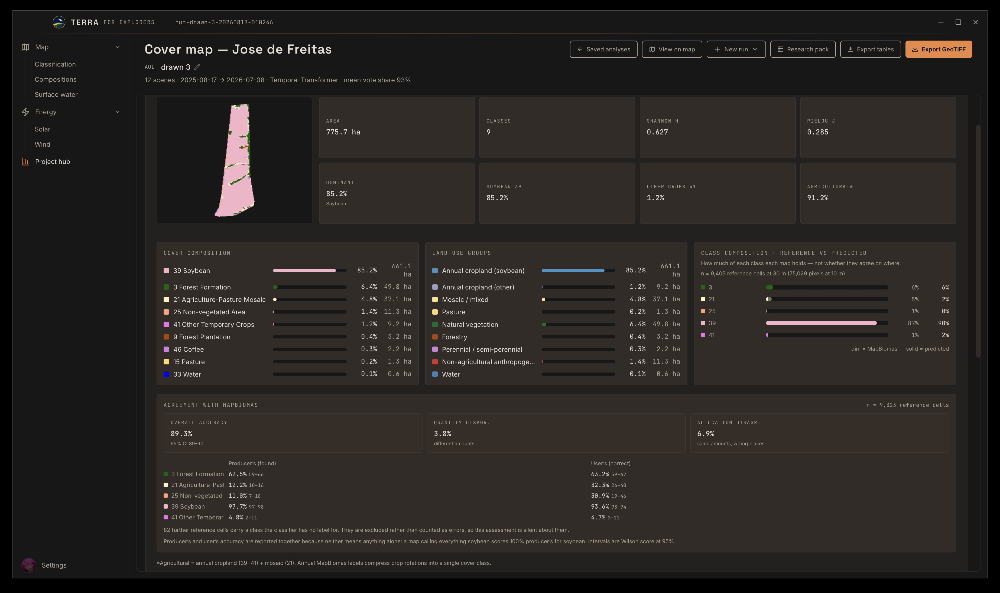
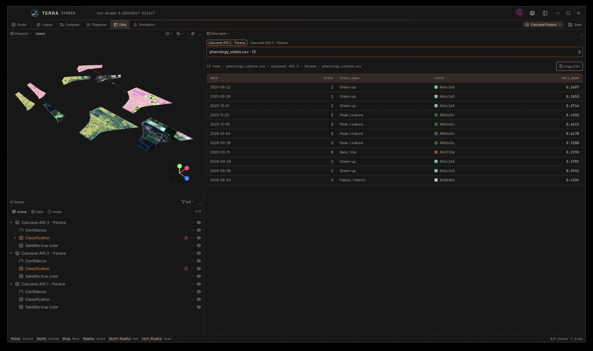

# TERRA

<p align="center">
  
</p>

TERRA classifies land cover over an area of interest from Sentinel-2 L2A time
series, and reports where that classification is wrong rather than only how
much of it is right. Around the classifier it carries three further products
for the same area: surface water from spectral indices, solar and wind
resource, and a canopy simulation grown from the crop that was classified.

It runs locally as a desktop application, with no account and no server.
Imagery is read on demand from the Microsoft Planetary Computer STAC catalog as
Cloud-Optimized GeoTIFFs: the polygon window and the required bands only, so no
full Sentinel-2 product is downloaded.

The scope is deliberate. TERRA is built to support research and the detailed
study of particular areas, at farm to landscape scale, under a fixed protocol.
It is not a general-purpose GIS and does not set out to cover the ground that
Earth Engine or QGIS already cover.

The classifiers deliver methods developed and validated in research. The
reference protocol is published:

> Melo, J. L. S., Magalhães, D. K., Kolodziej, J. E., Kuhn, E. V.
> *Automatic Land Cover Classification with Sentinel-2 and MapBiomas Time
> Series.* XLIV Brazilian Symposium on Telecommunications and Signal Processing
> (SBrT 2026), Salvador, BA, Brazil.

<p align="center">
  
</p>

<p align="center"><em>Explorer: draw an area, drag the acquisition window on the track, classify, read the class shares</em></p>

## Two surfaces

Work starts in the **Explorer**: the map, an area drawn or imported over it, the
acquisition window set on the track at the foot, and a run started.

The **Studio** is where results are arranged. The screen divides into the panels
a question needs (viewport, outliner, properties, comparison, domain shift,
data table, run band, canopy), and more than one area fits on the same board,
so two farms or the same farm in two seasons sit side by side. Five
arrangements ship ready: Layout, Compare, Diagnose, Data and Simulation. The
arrangement survives a restart; a set of readings survives it only if the board
is saved under a name.

<p align="center">
  
</p>

<p align="center"><em>Studio: three areas in Cascavel, Paraná, on one board, each with its own classification, statistics and agreement</em></p>

## What it produces

### Land cover

Three model paths over the same AOI protocol, all emitting the MapBiomas
classes `{3, 21, 25, 39, 41}`: forest formation, agriculture-pasture mosaic,
non-vegetated area, soybean, other temporary crops.

| Model | What it reads | Artifact |
|-------|---------------|----------|
| Spectro-temporal Random Forest (default) | 80 features per pixel: band statistics, NDVI/EVI/SAVI temporal descriptors, 22 raw NDVI dates | `rf_classifier.joblib`, 300 trees at depth 20 |
| Temporal Transformer | six bands padded to 22 dates, mean-pooled over time | `tt_mapbiomas.pt` |
| Prithvi-EO 2.0 300M | one acquisition, frozen embeddings with a Random Forest head | needs `requirements-prithvi.txt` |

Prithvi takes the middle scene of the window and discards the rest, so widening
the period changes which acquisition is read rather than how many.

### Where the classification is wrong

Agreement with MapBiomas is computed cell by cell, with per-class producer's and
user's accuracy and Wilson intervals. Quantity error and allocation error are
reported apart, because getting how much soybean there is wrong is a different
failure from getting where it is wrong.

Agreement is also broken into blocks across space. An average hides whether the
disagreement sits in one corner of the area or throughout it, and disagreement
throughout usually means the model is being asked about ground it did not learn.

The Diagnose workspace measures that distance between two runs directly:
symmetric KL divergence on NDVI, change-vector magnitude in training standard
deviations, RBF MMD, and a per-feature shift table, computed on standardised
samples when both runs carry a classify-time fingerprint. It diagnoses; it does
not adapt.

### Surface water

Spectral indices thresholded by Otsu per date. Three are available: NDWI
(McFeeters 1996), MNDWI (Xu 2006) and AWEI_nsh (Feyisa et al. 2014), with MNDWI
as the default. There is no trained model and no fixed legend, so this product
does not inherit the classifiers' domain limitation.

Pixels wet in more than 70% of the dates they were observed are reported as
persistent, and between 15% and 70% as ephemeral. The two are reported
separately and never summed.

### Energy[^energy-scope]

Four solar products and one for wind, over the same area:

- irradiation received at the point, from the NASA POWER hourly record;
- how that irradiation falls across the terrain, interpolated onto each cell's
  own slope and aspect from a Copernicus DEM GLO-30 grid;
- where within the area a plant can be sited, accounting for slope and for what
  already occupies the ground;
- what such a plant would yield, with each loss term declared;
- a screening of the wind resource.

Surface irradiance is not retrievable from Sentinel-2. There is no broadband
radiometer, the revisit is five days and the overpass is fixed, so these
products read a different family of source.

[^energy-scope]: The energy products are secondary. Crop and land-cover
    classification is what this project is built around, what the published
    protocol covers, and what the validation work applies to. Solar and wind
    were added because the same area and the same terrain data answer those
    questions too, not because they carry equivalent methodological backing.
    Treat their output as a screening step rather than as a siting study.

### Canopy simulation

The crop is grown from what the satellite measured, in four steps: the NDVI
series gives leaf area by inverting Beer-Lambert (Baret and Guyot 1991); leaf
area gives plant age against the known growth of 24 species; age drives the
growth itself; and the stand is lit by the hourly sun of its own location, with
cast shadows and the light colour of that sky. The reading at the end is the
fraction of light the canopy intercepts.

With the optional 3D package installed, plants are grown organ by organ from
the species' own architecture and then voxelised. Without it the canopy is
built from analytic ellipsoid crowns of the same leaf area, which needs nothing
beyond numpy.

<p align="center">
  
</p>

<p align="center"><em>Simulation: a soybean stand at day 68, with the season's LAI, the age curve and the light budget beside it</em></p>

## Limitations

Read these before trusting an output.

- **The output legend is fixed.** The crop models emit `{3, 21, 25, 39, 41}` and
  nothing else. They cannot predict pasture, savanna, or any other MapBiomas
  code. An area in another biome can return a confident and semantically wrong
  result, which is why domain-shift diagnosis exists.
- **The models were fitted for western Paraná study areas.** The training data
  are not distributed with this application.
- **MapBiomas is not field truth.** Agreement is concordance with an annual map,
  often offset in time from the Sentinel-2 series. The reference is Collection
  10, year 2023.
- **Class 41 is a residual bucket.** High overall accuracy against MapBiomas
  does not imply fine crop identity.
- **Areas in hectares are pixel counts**, uncorrected for classification error.
- **Point energy figures do not resolve the field.** NASA POWER radiation is on
  a one-degree cell and the other meteorology, wind included, on a 0.5 by 0.625
  degree MERRA-2 cell. The terrain and siting maps are the exception: those
  resolve within the area at 30 m from the DEM.
- **The export package is partial.** It carries the run's tables, AOI geometry
  and classification raster; the accuracy assessment and the domain-shift report
  are not in it.
- **A board's contents do not survive closing** unless the board is saved under
  a name. The arrangement survives either way.

## Quick start

1. Download a **FULL** release zip, which embeds Python, or a **LITE** zip plus
   Python 3.12 and `pip install -r requirements.txt`. See
   [Install](docs/INSTALL.md).
2. Open TERRA. Set `TERRA_PYTHON` only for LITE or a custom interpreter.
3. Draw an area on the map, or import one.
4. Set the acquisition window on the track, pick a model, press **Classify**.
5. Read the result on the map, or open the **Studio** to arrange it beside
   another run.

If the interpreter cannot import what the sidecar needs, TERRA says which
package is missing and what it stops working, and offers to build its own
environment. That environment is kept outside the application and survives an
update.

## Gallery

| Compare | Diagnose |
|:-------:|:--------:|
|  |  |
| Confusion against the reference, accuracy delta, agreement by block | Domain shift between two runs: NDVI divergence, feature space, Pontius disagreement |

| Analysis | Data |
|:--------:|:----:|
|  |  |
| Cover map: composition, land-use groups, agreement with MapBiomas | Every table the run produced, readable and copyable |

## Research and this repository

Methods are prototyped and validated in dedicated research work (papers,
notebooks, and private experiment repositories) under literature review,
implementation and tests. This project packages what is stable enough for
interactive use. Change detection, crop stress diagnostics, MapBiomas class-41
decomposition and topography-related workflows are still in that stage; see the
[Roadmap](docs/ROADMAP.md).

- Bug reports, UX and packaging: [GitHub Issues](https://github.com/rexionmars/TERRA/issues)
- Method collaboration and research themes:
  [joao_leonardi.melo@somosicev.com](mailto:joao_leonardi.melo@somosicev.com) ·
  [opensource.leonardi@gmail.com](mailto:opensource.leonardi@gmail.com)

### AI agent usage in this software

I am not an experienced Full-Stack developer; my background is mainly in machine learning, deep learning, and remote sensing / Earth observation. Therefore, I used AI coding assistants to help me build this software.

The parts of this repository do not all carry the same confidence, and it is worth saying which is which. Much of the frontend code may contain bugs or inconsistencies, since I do not know a great deal about the technologies in that specific area; I correct them over time, as they turn up. The sidecar is a different case: it is where the methods from the private research repository reach this public one, so I write and review it constantly, and the same holds for the Go backend.

All field and academic research I conduct undergoes review by my professors (sometimes from more than two institutions). Depending on the scientific value of the content produced, we evaluate the possibility of publishing papers in conferences or journals. This research takes place in a private institutional repository. If you'd like to collaborate or discuss these topics, feel free to send me an email, and I'll be happy to connect!

## Download

| Flavor | Example assets | Notes |
|--------|----------------|-------|
| **FULL** | `TERRA-macOS-arm64-full.zip`, `TERRA-*-amd64-full.zip` | Embeds Python 3.12 and the spectral RF dependencies |
| **LITE** | `TERRA-macOS-universal-lite.zip`, `TERRA-*-amd64-lite.zip` | Needs system Python and [`requirements.txt`](requirements.txt) |

Temporal Transformer and Prithvi need [`requirements-prithvi.txt`](requirements-prithvi.txt);
3D plant growth needs [`requirements-helios.txt`](requirements-helios.txt). Both
can be installed from Settings › System into the environment already in use.

## Documentation

| Doc | Contents |
|-----|----------|
| [User guide](docs/USER_GUIDE.md) | Area → classify → overlays → analysis → compare |
| [Install](docs/INSTALL.md) | LITE vs FULL, Python, from source |
| [Architecture](docs/ARCHITECTURE.md) | Wails shell, sidecar, STAC/COG |
| [API](docs/API.md) | Go bindings and sidecar JSON |
| [Roadmap](docs/ROADMAP.md) | Packaging and research themes |
| [Releasing](docs/RELEASING.md) | SemVer, code names, the splash still |
| [Troubleshooting](docs/TROUBLESHOOTING.md) | Python, STAC, models, macOS |
| [Contributing](CONTRIBUTING.md) | Issues, PRs, tests |
| [Design](docs/DESIGN.md) | Visual tokens |
| [JOSS paper draft](paper/paper.md) | Manuscript and BibTeX |

## Architecture

```
TERRA/
├── main.go / app.go     Wails window and frontend bindings
├── backend/             Sidecar runner, geocode, types, SQLite store
├── sidecar/             Inference: STAC, features, models, LULC, phenology,
│                        water, solar, wind, canopy
├── model/               Trained artifacts (.joblib / .pt)
├── areas/               Embedded example polygons (GeoJSON)
├── frontend/            React 19 + Vite 7 + Tailwind 4 + Leaflet + three.js
└── docs/
```

| Layer | Technology |
|-------|------------|
| Shell | Wails v2 (Go) |
| Frontend | React 19, Vite 7, TypeScript, Tailwind CSS 4 |
| Map | Leaflet, react-leaflet, leaflet-draw |
| 3D | three.js |
| Charts | Recharts |
| Inference | Python 3.12, scikit-learn, rasterio, pystac-client, planetary-computer |

The three polygons in `areas/` are used by the inference engine and remain in
the package. They are no longer offered as a choice in the interface.

## Development

```bash
pip install -r requirements.txt
cd frontend && npm ci && cd ..
wails dev
```

```bash
wails build    # → build/bin/
```

```bash
go test ./backend/...
pip install -r requirements-dev.txt
pytest sidecar/tests -q
```

## Requirements

- **FULL:** no system Python for the spectral Random Forest
- **LITE or source:** Python 3.12 and [`requirements.txt`](requirements.txt)
- **Optional:** [`requirements-prithvi.txt`](requirements-prithvi.txt) for the
  neural models, [`requirements-helios.txt`](requirements-helios.txt) for 3D growth
- **From source:** Go 1.23+, Node.js 18+, [Wails CLI](https://wails.io)

Interpreter resolution: `TERRA_PYTHON` → bundled `python/` (FULL) → `.venv` → `python3`.

| Variable | Purpose |
|----------|---------|
| `TERRA_PYTHON` | Python for the sidecar |
| `TERRA_APP_DIR` | Directory holding `sidecar/`, `areas/`, `model/` |
| `TERRA_MODEL_DIR` | Model directory, default `model/` |

## Data sources

| Source | Used for |
|--------|----------|
| [Microsoft Planetary Computer](https://planetarycomputer.microsoft.com/) STAC | Sentinel-2 L2A imagery |
| MapBiomas Brazil COGs | Land-cover reference, when the area intersects Brazil |
| [NASA POWER](https://power.larc.nasa.gov/) | Hourly radiation and meteorology |
| Copernicus DEM GLO-30 | Slope, aspect and horizon |
| [Nominatim](https://nominatim.openstreetmap.org/) | Geocoding |
| Esri World Imagery, EOX Sentinel-2 cloudless 2025 | Basemaps |

## License and community

GNU General Public License v3.0, in [LICENSE](LICENSE). TERRA is copyleft: a
distributed work built on it carries the same terms.

Contributions: [CONTRIBUTING.md](CONTRIBUTING.md) ·
[Issues](https://github.com/rexionmars/TERRA/issues).
