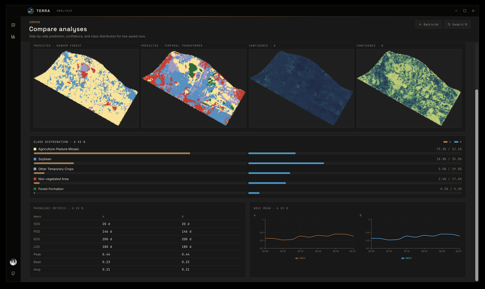
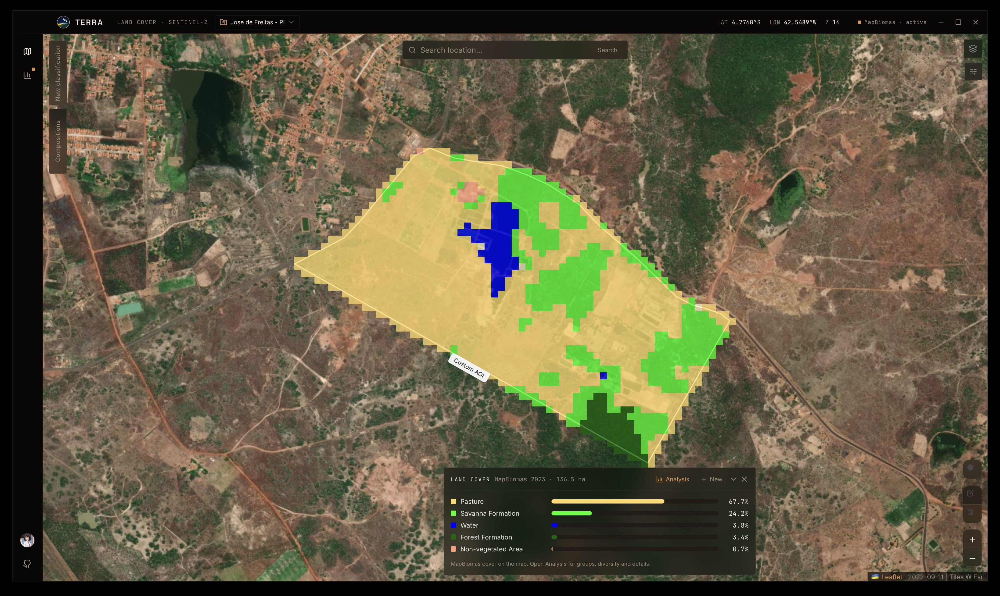
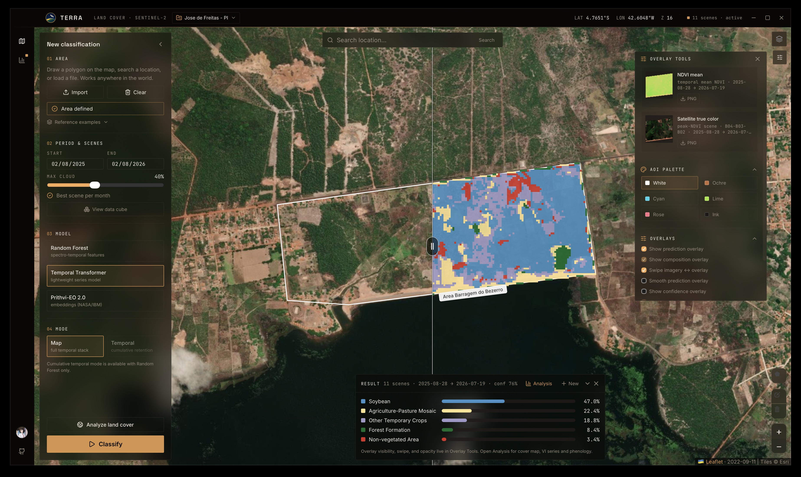
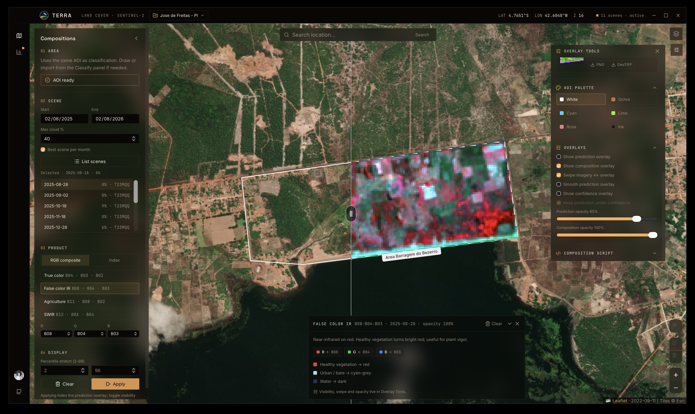

# TERRA

<p align="center">
  
</p>

**TERRA** is a desktop app that runs **AOI-scale land-cover classification** on
Sentinel-2 L2A time series. It is the **delivery layer** for methods developed
and validated in research — not another generic STAC viewer.

Imagery comes from the Microsoft Planetary Computer STAC catalog as
Cloud-Optimized GeoTIFFs (polygon window + bands only; no full-scene download).

## What this project claims

| Claim | Where it lives |
|-------|----------------|
| Spectro-temporal **Random Forest** (≈80 features) aligned with a published protocol | Default model in-app; paper below |
| Same AOI protocol for **Temporal Transformer** and **Prithvi-EO 2.0** heads | Optional models (`requirements-prithvi.txt`) |
| Map UI for classify → confidence → phenology → MapBiomas LULC → **Compare** / **export** | This repository |
| New methods (change detection, crop stress, class-41 decomposition, …) | Developed in research repos; land in TERRA after validation |

> Melo, J. L. S., Magalhães, D. K., Kolodziej, J. E., Kuhn, E. V.
> *Automatic Land Cover Classification with Sentinel-2 and MapBiomas Time
> Series.* XLIV Brazilian Symposium on Telecommunications and Signal Processing
> (SBrT 2026), Salvador, BA, Brazil.

The public contribution is **reproducible AOI-scale inference** of that family
of methods (plus documented extensions), not a new GIS platform.

<p align="center">
  
</p>

<p align="center"><em>Example: Random Forest vs Temporal Transformer on a study AOI (same Sentinel-2 stack)</em></p>

## Methods in the app

| Status | Capability |
|--------|------------|
| **In app** | Spectral RF; Temporal Transformer; Prithvi-EO 2.0 + RF heads; MapBiomas LULC context; VI / phenology; Projects; Overlay Tools; Compare; analysis **export** package |
| **Published / reference** | SBrT 2026 spectro-temporal RF protocol |
| **In research** | Change detection, flood / surface water, crop stress diagnostics, MapBiomas class-41 decomposition, topography-related workflows — see [Roadmap](docs/ROADMAP.md) |

### Spectral Random Forest (default)

- Features: spectro-temporal stack over the AOI (band statistics + temporal
  descriptors; soybean retention settings from the reference pipeline).
- Labels / legend used in shipped heads: MapBiomas-style classes
  **{3, 21, 25, 39, 41}** (forest, mosaic, non-vegetated, soybean, other
  temporary crops) as trained for the western Paraná study areas.
- Embedded example polygons **A / B / C** match the reference farms.

### Temporal Transformer / Prithvi

- **TT:** series model on the reflectance cube (`tt_mapbiomas.pt`).
- **Prithvi-EO 2.0 300M:** frozen embeddings + RF heads (`pixel` / `patch`);
  needs torch / terratorch ([`requirements-prithvi.txt`](requirements-prithvi.txt)).
- Retrain helpers: `sidecar/train_prithvi.py`.

### MapBiomas LULC (descriptive)

Independent of the crop classifier: composition, groups, diversity metrics, and
optional pred-vs-ref on overlapping classes — via Brazil Collection COGs when
the AOI intersects Brazil (`sidecar/lulc.py`).

### Export package

**Analysis → Export tables** writes a ZIP with `manifest.json`,
`class_stats.csv`, VI / phenology CSVs, MapBiomas tables, AOI GeoJSON, and
`rasters/classification.tif` when available — so a run can be re-analyzed
outside the UI.

## Limitations (read this)

- **Fixed output legend.** Crop models emit the trained class set
  `{3, 21, 25, 39, 41}`. They cannot predict pasture, savanna, or other MapBiomas
  codes outside that head. AOIs in other biomes may look “confident” and still be
  **semantically wrong** (domain shift). **Analysis → Compare** quantifies that
  gap (KL on NDVI, CVA, RBF MMD, F1 / outside-legend rates) when both runs
  carry a classify-time domain fingerprint — diagnosis only; adaptation training
  stays in the research repo.
- **MapBiomas ≠ field truth.** Agreement metrics are concordance with an annual
  map, often time-offset from the Sentinel-2 series — not pixel-level crop labels.
- **Class 41 is a residual bucket** (“other temporary crops”). High OA against
  MapBiomas does not mean fine crop identity.
- **FULL install** covers spectral RF; TT / Prithvi need extra Python deps.
- TERRA is **not** Earth Engine / QGIS replacement; it targets farm- to
  landscape-scale AOIs with a fixed research protocol.

<p align="center">
  
</p>

<p align="center"><em>MapBiomas reference context on a study AOI — use it as concordance, not ground truth</em></p>

## Statement of need

AOI-scale agricultural land-cover work often stalls on:

1. Notebook-only pipelines that collaborators cannot open on a map.
2. Full-scene downloads when only a polygon matters.
3. Comparing RF vs transformer vs foundation embeddings across ad-hoc scripts.

TERRA keeps the **method** (sidecar models + STAC/COG clip) and adds a local UI
for classify, inspect, compare, and export — without an app cloud account.

## Research vs this repository

Methods are prototyped and validated in dedicated research work (papers,
notebooks, private experiment repos). This GitHub project packages what is
stable enough for interactive use. Longer manuals and reports are in preparation
(Overleaf); until then use [docs/USER_GUIDE.md](docs/USER_GUIDE.md).

- **Bug reports / UX / packaging:** [GitHub Issues](https://github.com/rexionmars/TERRA/issues)
- **Method collaboration / research themes:**  
  [joao_leonardi.melo@somosicev.com](mailto:joao_leonardi.melo@somosicev.com) ·
  [opensource.leonardi@gmail.com](mailto:opensource.leonardi@gmail.com)

## AI Agent Usage in this Software:

I am not an experienced Full-Stack developer; my background is mainly in machine learning, deep learning, and remote sensing / Earth observation. Therefore, I used CursorAI to assist me with the development of this software.

All field and academic research I conduct undergoes review by my professors (sometimes from more than two institutions). Depending on the scientific value of the content produced, we evaluate the possibility of publishing papers in conferences or journals. This research takes place in a private institutional repository. If you’d like to collaborate or discuss these topics, feel free to send me an email, and I’ll be happy to connect!

## Quick start

1. Prefer a **FULL** release zip (embeds Python), or Python 3.12 +
   `pip install -r requirements.txt` for **LITE** — [Install](docs/INSTALL.md).
2. Download from [releases](https://github.com/rexionmars/TERRA/releases) or run
   `wails dev` from source.
3. Open TERRA (`TERRA_PYTHON` only if LITE / custom interpreter).
4. Project → AOI (example **A**, draw, or import) → date range → model
   **spectral** → **Classify**.
5. **Overlay Tools** (visibility, swipe, export) → **Analysis** (cover map, VI,
   phenology, MapBiomas) → optional **Compare** of two runs.

## UI overview

- **Projects** — AOI label vs inference `run-*` names stay separate.
- **Compositions** — RGB / indices for a chosen Sentinel-2 scene.
- **Classify** — RF / Temporal Transformer / Prithvi; cloud filter; monthly
  scene pick (lowest cloud) by default.
- **Overlay Tools** — prediction, confidence, composition, opacity, swipe, export.
- **Analysis / Compare** — class stats, VI, phenology, MapBiomas LULC, side-by-side runs.
- **Settings** + **What’s New** after version bumps.

<p align="center">
  
</p>

<p align="center"><em>Map workspace — classify an AOI, then manage overlays in Overlay Tools</em></p>

## Gallery

| Projects | Classification |
|:--------:|:--------------:|
|  |  |

| Band compositions | Overlay Tools |
|:-----------------:|:-------------:|
|  |  |

| Analysis | Settings |
|:--------:|:--------:|
|  |  |

## Documentation

| Doc | Contents |
|-----|----------|
| [User guide](docs/USER_GUIDE.md) | AOI → Projects → classify → Overlay → Analysis → Compare |
| [Install](docs/INSTALL.md) | LITE vs FULL, Python, from-source |
| [Architecture](docs/ARCHITECTURE.md) | Wails shell, sidecar, STAC/COG |
| [API](docs/API.md) | Go bindings and sidecar JSON |
| [Roadmap](docs/ROADMAP.md) | Packaging and research themes |
| [Releasing](docs/RELEASING.md) | SemVer |
| [Troubleshooting](docs/TROUBLESHOOTING.md) | Python, STAC, models, macOS |
| [Contributing](CONTRIBUTING.md) | Issues, PRs, tests |
| [Design](docs/DESIGN.md) | Visual tokens |
| [JOSS paper draft](paper/paper.md) | Manuscript + BibTeX for Journal of Open Source Software |

## Download

| Flavor | Example assets | Notes |
|--------|----------------|-------|
| **FULL** | `TERRA-macOS-arm64-full.zip`, `TERRA-*-amd64-full.zip` | Embeds Python 3.12 + spectral RF deps |
| **LITE** | `TERRA-macOS-universal-lite.zip`, `TERRA-*-amd64-lite.zip` | Needs system Python + [`requirements.txt`](requirements.txt) |

TT / Prithvi: [`requirements-prithvi.txt`](requirements-prithvi.txt). Details in
[docs/INSTALL.md](docs/INSTALL.md).

## Architecture

```
TERRA/
├── main.go / app.go     Wails window and frontend bindings
├── backend/             Sidecar runner, geocode, types, SQLite store
├── sidecar/             Inference (STAC, features, models, LULC, phenology)
├── model/               Trained artifacts (.joblib / .pt)
├── areas/               Embedded example polygons (GeoJSON)
├── frontend/            React 19 + Vite 7 + Tailwind 4 + Leaflet
└── docs/
```

| Layer | Technology |
|-------|------------|
| Shell | Wails v2 (Go) |
| Frontend | React 19, Vite 7, TypeScript, Tailwind CSS 4 |
| Map | Leaflet, react-leaflet, leaflet-draw |
| Charts | Recharts |
| Inference | Python 3.12, scikit-learn, rasterio, pystac-client, planetary-computer |

## Requirements

- **FULL:** no system Python for spectral RF
- **LITE / source:** Python 3.12 + [`requirements.txt`](requirements.txt)
- **Prithvi (optional):** [`requirements-prithvi.txt`](requirements-prithvi.txt)
- **From source:** Go 1.23+, Node.js 18+, [Wails CLI](https://wails.io)

Interpreter: `TERRA_PYTHON` → bundled `python/` (FULL) → `.venv` → `python3`.

## Development

```bash
pip install -r requirements.txt
cd frontend && npm ci && cd ..
wails dev
```

```bash
wails build    # → build/bin/
```

```bash
go test ./backend/...
pip install -r requirements-dev.txt
pytest sidecar/tests -q
```

## Configuration

| Variable | Purpose |
|----------|---------|
| `TERRA_PYTHON` | Python for the sidecar |
| `TERRA_APP_DIR` | Directory with `sidecar/`, `areas/`, `model/` |
| `TERRA_MODEL_DIR` | Model directory (default `model/`) |

## Data sources

- Sentinel-2 L2A — [Microsoft Planetary Computer](https://planetarycomputer.microsoft.com/) STAC
- MapBiomas Brazil COGs — land-cover context (when AOI ∩ Brazil)
- Geocoding — [Nominatim](https://nominatim.openstreetmap.org/)
- Basemaps — Esri World Imagery, EOX Sentinel-2 cloudless 2025

## License and community

MIT — [LICENSE](LICENSE).

Contributions: [CONTRIBUTING.md](CONTRIBUTING.md) ·
[Issues](https://github.com/rexionmars/TERRA/issues).
