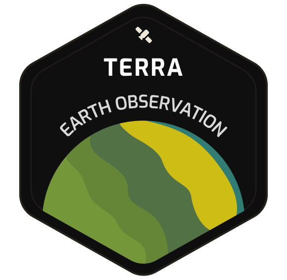
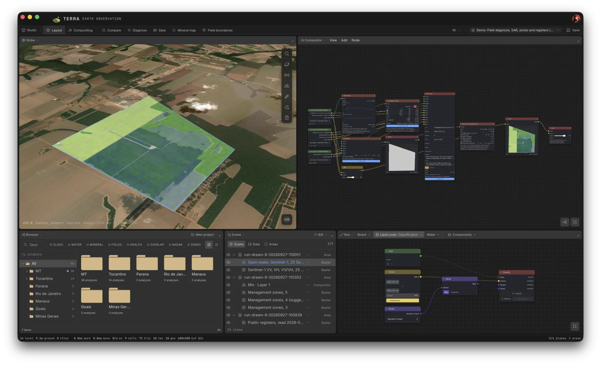
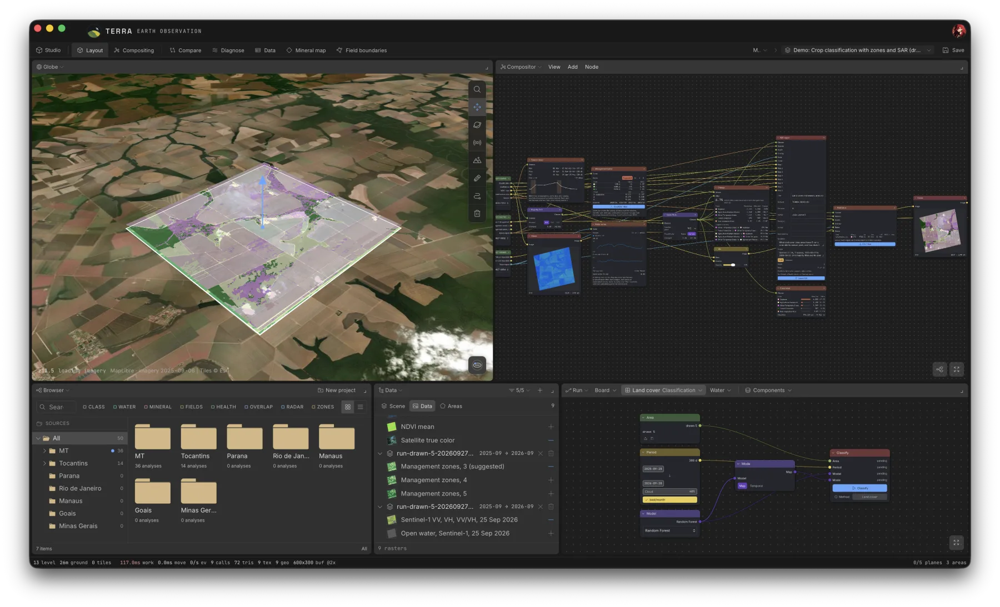
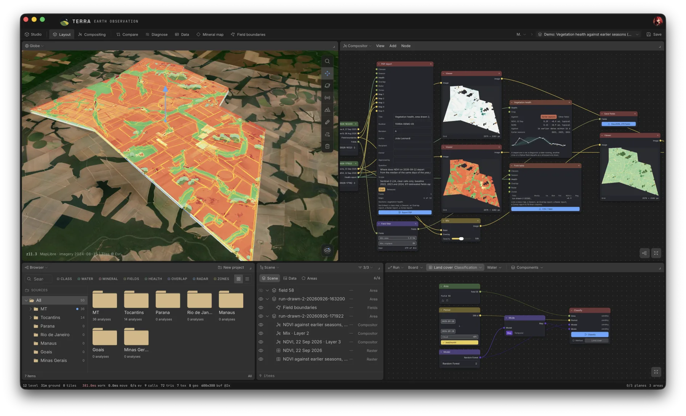
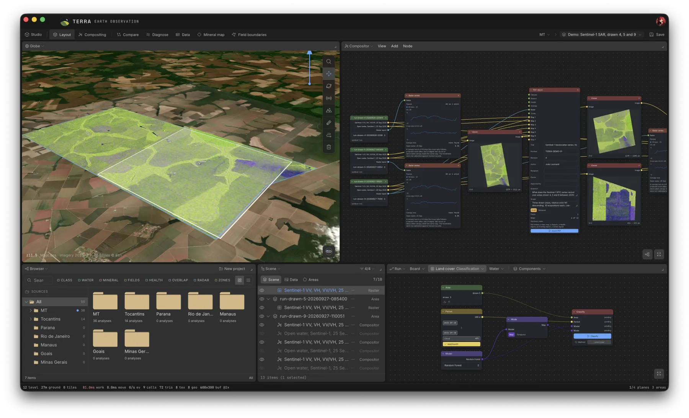
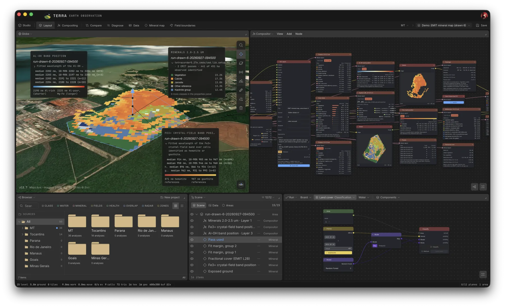
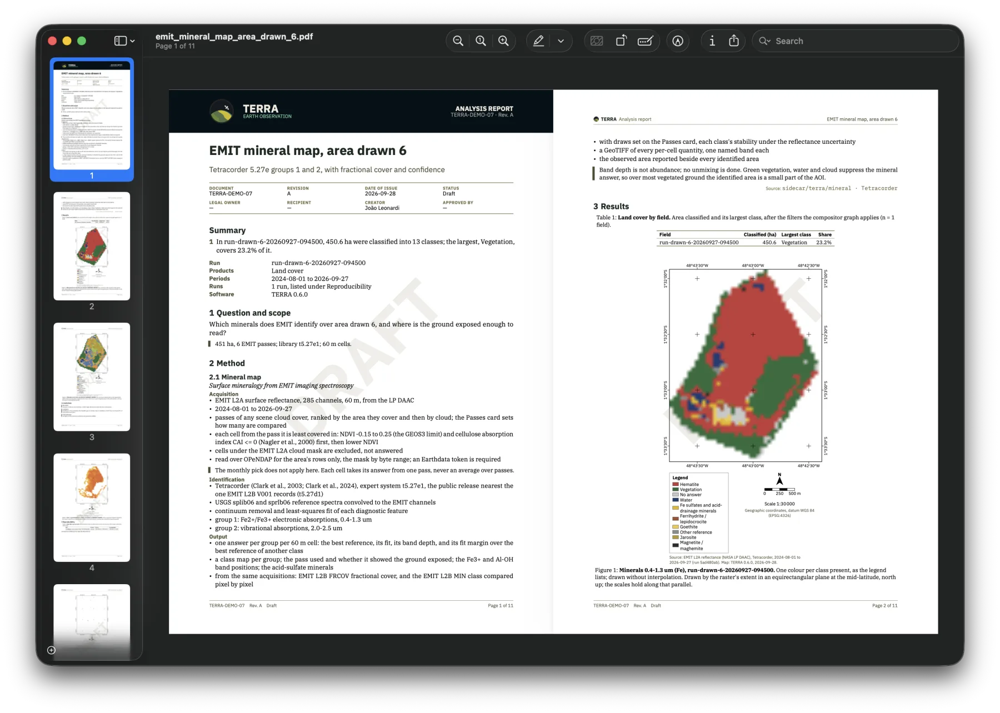

# TERRA Earth Observation

<p align="center">
  
</p>

TERRA classifies land cover over an area of interest from Sentinel-2 L2A time
series, and reports where that classification is wrong rather than only how
much of it is right. Around the classifier it carries further products for the
same area: surface water from spectral indices, field boundaries, vegetation
health against earlier seasons, overlap with public registers, a Sentinel-1
backscatter series, management zones, and a surface mineral map from EMIT
imaging spectroscopy.

It runs locally as a desktop application, with no account and no server.
Imagery is read on demand from the Microsoft Planetary Computer STAC catalog as
Cloud-Optimized GeoTIFFs: the polygon window and the required bands only, so no
full Sentinel-2 product is downloaded.

The scope is deliberate. TERRA is built to support research and the detailed
study of particular areas, at farm to landscape scale, under a fixed protocol.
It is not a general-purpose GIS and does not set out to cover the ground that
Earth Engine or QGIS already cover.

<p align="center">
  
</p>

<p align="center"><em>Three areas on one board: the radar series, management zones and public-register overlap of each read as compositor nodes and gathered into one PDF report, with a compositor layer drawn over its ground on the globe</em></p>

## The map, and the studio over it

Work starts on the map: an area drawn or imported, the acquisition window set
on the track at the foot, and a run started.

The **studio** opens over that map, and closes back onto it. It is where
results are arranged: the screen divides into the panels a question needs
(viewport, outliner, properties, comparison, domain shift, spectral response,
library check, rover, data table, run band), and more than one area
fits on the same board, so two farms or the same farm in two seasons sit side
by side. Four arrangements ship ready: Layout, Compare, Diagnose and Data. The
arrangement survives a restart; a set of readings survives it only if the board
is saved under a name.

It exists because a map cannot do this. A map puts things where they are, so
two areas hundreds of kilometres apart cannot be set beside each other on one.
Everything else the studio offers follows from that one constraint.

The **compositor** is where the products of a board are combined. Each run
offers its outputs as sockets; nodes filter, mask, mix and tabulate them, and
read each product as a card: the season of a classification, the departure of a
health run, the hectares of an overlap, the passes of a radar series. A Globe
node draws its result over the ground, a Viewer beside the graph, and a PDF
report node writes up whatever reaches it. Under a field set the same graph is
evaluated once per field.

<p align="center">
  
</p>

<p align="center"><em>Crop classification with zones and SAR data</em></p>

Comparison is the arrangement that answers where a classification is wrong
rather than how much of it is right: the confusion against the reference, the
accuracy delta per class, and the agreement read block by block instead of as
one number over the whole area.

Data is the arrangement for what a run leaves behind as numbers. The research
pack's tables are read in place and copied out as CSV: the phenology metrics,
the vegetation-index series date by date, and the predicted class shares against
the reference.

## What it produces

### Land cover

Three model paths over the same AOI protocol, all emitting the MapBiomas
classes `{3, 21, 25, 39, 41}`: forest formation, agriculture-pasture mosaic,
non-vegetated area, soybean, other temporary crops.

| Model | What it reads | Artifact |
|-------|---------------|----------|
| Spectro-temporal Random Forest (default) | 80 features per pixel: band statistics, NDVI/EVI/SAVI temporal descriptors, 22 raw NDVI dates | `rf_classifier.joblib`, 300 trees at depth 20 |
| Temporal Transformer | six bands padded to 22 dates, mean-pooled over time | `tt_mapbiomas.pt` |
| Prithvi-EO 2.0 300M | one acquisition, frozen embeddings with a Random Forest head | needs `requirements-prithvi.txt` |

Prithvi takes the middle scene of the window and discards the rest, so widening
the period changes which acquisition is read rather than how many.

### Where the classification is wrong

Agreement with MapBiomas is computed cell by cell, with per-class producer's and
user's accuracy and Wilson intervals. Quantity error and allocation error are
reported apart, because getting how much soybean there is wrong is a different
failure from getting where it is wrong.

Agreement is also broken into blocks across space. An average hides whether the
disagreement sits in one corner of the area or throughout it, and disagreement
throughout usually means the model is being asked about ground it did not learn.

The Diagnose workspace measures that distance between two runs directly:
symmetric KL divergence on NDVI, change-vector magnitude in training standard
deviations, RBF MMD, and a per-feature shift table, computed on standardised
samples when both runs carry a classify-time fingerprint. It diagnoses; it does
not adapt.

The same arrangement reads a single run from the other side: the spectral
response of each predicted class on one acquisition, each class's spectral angle
to a leaf-level library, and how far each pair of classes can be told apart one
band at a time.

### Surface water

Spectral indices thresholded by Otsu per date. Three are available: NDWI
(McFeeters 1996), MNDWI (Xu 2006) and AWEI_nsh (Feyisa et al. 2014), with MNDWI
as the default. There is no trained model and no fixed legend, so this product
does not inherit the classifiers' domain limitation.

Pixels wet in more than 70% of the dates they were observed are reported as
persistent, and between 15% and 70% as ephemeral. The two are reported
separately and never summed.

### Field boundaries

Fields are delineated from two Sentinel-2 scenes, the clearest of each of two
windows the period is cut into, with the Fields of The World baseline (U-Net,
EfficientNet-B7; Kerner et al., 2025). Each connected interior region becomes
one polygon with its area, perimeter and the network's mean interior vote, and
the fields can be made areas of their own. Vegetation health, register overlap,
radar and management zones then run over the fields of an area as a queue of
jobs.

### Vegetation health

NDVI and NDRE of every clear acquisition in the period, against the
acquisitions within 16 days of the same day of the year in the three seasons
before, as a departure in standard deviations. NDRE is read beside NDVI because
NDVI saturates over a closed canopy (Gitelson and Merzlyak, 1994). In the
compositor the fields of a set are also compared with each other on a date they
share.

<p align="center">
  
</p>

<p align="center"><em>Vegetation health over delineated fields: NDVI on one date against the median of the same days in earlier seasons, draped over the ground with the field boundaries, and the graph that filters the fields, tabulates them and writes the report</em></p>

### Public-register overlap

The hectares of an area on PRODES and DETER (INPE), IBAMA and ICMBio embargoes,
indigenous lands (FUNAI), conservation units (CNUC) and CAR property
registrations (SICAR), each read from its public service when the job runs and
recorded with that moment. Areas are measured in an equal-area projection
centred on the area, and overlapping features of one register count once. A
register that cannot be read is reported with its reason, never as zero.

### Radar

Sentinel-1 RTC gamma0 VV and VH through the period, one pass per date and
relative orbit, with the orbits kept apart because the incidence angle sets the
backscatter level. The series carries the cross ratio VH/VV, open water by fixed
VH and VV thresholds after a Lee filter, and canopy losses where VH and the cross
ratio fall together between two passes of one orbit. Cloud does not interrupt
it.

<p align="center">
  
</p>

<p align="center"><em>Sentinel-1 over three areas: the VV, VH and VH/VV composite on the globe, and per area the radar series card with its passes, cross ratio, open water and canopy losses</em></p>

### Management zones

Zones where a field grew alike over several seasons, after Management Zone
Analyst: the 90th percentile of NDVI per season and 10 m cell, standardised over
the field, clustered by fuzzy c-means (Bezdek, 1981) into three, four and five
zones, with the number suggested by FPI and NCE (Odeh et al., 1992). The
polygons export as GeoJSON.

### Mineral map

Surface mineralogy from EMIT L2A reflectance (285 channels, 60 m), identified by
a port of Tetracorder (Clark et al., 2003; Clark et al., 2024), rule set
t5.27e1, against the USGS spectral library. Each cell is answered from the one
pass in which it is least covered by vegetation, never from an average over
passes, in two groups: Fe2+/Fe3+ electronic absorptions (0.4-1.3 µm) and
vibrational absorptions (2.0-2.5 µm). The run also gives the Fe3+ and Al-OH band
positions, the stability of each class under the reflectance uncertainty, and
the EMIT L2B mineral product compared pixel by pixel. An Earthdata token is
required.

<p align="center">
  
</p>

<p align="center"><em>The mineral map of one area: the 2.0-2.5 µm classes on the globe beside the Al-OH and Fe3+ band positions, and the map's figures as compositor cards</em></p>

### Reports

The PDF report node writes up what reaches it: identification and revision, a
summary of counts and ranges, the question and scope as typed on the node, the
method as the runs record it, up to twelve maps with graticule, scale bar and
legend, one table per product, and the limitations. Its tables are the Field
table's own rows, so the PDF and the card cannot disagree. The document is laid
out by Typst inside the Python environment, with the fonts bundled, and needs no
TeX installation and no network.

<p align="center">
  
</p>

<p align="center"><em>A report of the mineral map of one area: identification, summary, question and scope, method, and the class map with its graticule, scale bar and legend</em></p>

## Limitations

Read these before trusting an output.

- **The output legend is fixed.** The crop models emit `{3, 21, 25, 39, 41}` and
  nothing else. They cannot predict pasture, savanna, or any other MapBiomas
  code. An area in another biome can return a confident and semantically wrong
  result, which is why domain-shift diagnosis exists.
- **The models were fitted for western Paraná study areas.** The training data
  are not distributed with this application.
- **MapBiomas is not field truth.** Agreement is concordance with an annual map,
  often offset in time from the Sentinel-2 series. The reference is Collection
  10, year 2023.
- **Class 41 is a residual bucket.** High overall accuracy against MapBiomas
  does not imply fine crop identity.
- **Areas in hectares are pixel counts**, uncorrected for classification error.
- **The export package is partial.** It carries the run's tables, AOI geometry
  and classification raster; the accuracy assessment and the domain-shift report
  are not in it.
- **A board's contents do not survive closing** unless the board is saved under
  a name. The arrangement survives either way.
- **Field boundaries are not measured here.** The delineation network reports
  pixel IoU 0.76 and object F1 0.47 on its own test set, which holds no Paraná
  field. Adjacent fields sown with one crop on one day come out as one.
- **A health departure is not a diagnosis.** A later sowing, another crop or a
  fallow field departs from earlier seasons as a stressed one does.
- **An overlap is not a finding of irregularity.** A clearing can be
  authorised and an embargo lifted after publication. APP and legal-reserve
  polygons are not published by WFS and are not read.
- **The radar canopy-loss thresholds are not calibrated** against harvest
  records, and a lodged or desiccated canopy reads as a harvest does. Paved
  ground, radar shadow and smooth bare soil can read as open water.
- **Management zones show where the canopy differed, not why.** Soil, drainage,
  compaction or a past management line draw the same boundary.
- **Mineral band depth is not abundance.** No unmixing is done, and vegetation,
  water and cloud suppress the answer, so over vegetated ground the identified
  area is a small part of the area of interest.

## Quick start

1. Download a **FULL** release zip, which embeds Python, or a **LITE** zip plus
   Python 3.12 and `pip install -r requirements.txt`. See
   [Install](docs/INSTALL.md).
2. Open TERRA. Set `TERRA_PYTHON` only for LITE or a custom interpreter.
3. Draw an area on the map, or import one.
4. Set the acquisition window on the track, pick a model, press **Classify**.
5. Read the result on the map, or open the **studio** from the title bar to
   arrange it beside another run.

If the interpreter cannot import what the sidecar needs, TERRA says which
package is missing and what it stops working, and offers to build its own
environment. That environment is kept outside the application and survives an
update.

## Research and this repository

Methods are prototyped and validated in dedicated research work (papers,
notebooks, and private experiment repositories) under literature review,
implementation and tests, with academic supervision. This project packages what
is stable enough for interactive use. Change detection, crop stress
diagnostics, MapBiomas class-41 decomposition and topography-related workflows
are still in that stage; see the [Roadmap](docs/ROADMAP.md).

- Bug reports, UX and packaging: [GitHub Issues](https://github.com/rexionmars/TERRA/issues)
- Method collaboration and research themes:
  [joao_leonardi.melo@somosicev.com](mailto:joao_leonardi.melo@somosicev.com) ·
  [opensource.leonardi@gmail.com](mailto:opensource.leonardi@gmail.com)

### AI agent usage in this software

I am not an experienced Full-Stack developer; my background is mainly in machine learning, deep learning, and remote sensing / Earth observation. Therefore, I used AI coding assistants to help me build this software.

The parts of this repository do not all carry the same confidence, and it is worth saying which is which. Much of the frontend code may contain bugs or inconsistencies, since I do not know a great deal about the technologies in that specific area; I correct them over time, as they turn up. The sidecar is a different case: it is where the methods from the private research repository reach this public one, so I write and review it constantly, and the same holds for the Go backend.

## Download

| Flavor | Example assets | Notes |
|--------|----------------|-------|
| **FULL** | `TERRA-macOS-arm64-full.zip`, `TERRA-*-amd64-full.zip` | Embeds Python 3.12 and the spectral RF dependencies |
| **LITE** | `TERRA-macOS-universal-lite.zip`, `TERRA-*-amd64-lite.zip` | Needs system Python and [`requirements.txt`](requirements.txt) |

Temporal Transformer and Prithvi need [`requirements-prithvi.txt`](requirements-prithvi.txt),
which can be installed from Settings › System into the environment already in use.

## Documentation

| Doc | Contents |
|-----|----------|
| [User guide](docs/USER_GUIDE.md) | Area → classify → overlays → analysis → compare |
| [Install](docs/INSTALL.md) | LITE vs FULL, Python, from source |
| [Architecture](docs/ARCHITECTURE.md) | Wails shell, sidecar, STAC/COG |
| [API](docs/API.md) | Go bindings and sidecar JSON |
| [Roadmap](docs/ROADMAP.md) | Packaging and research themes |
| [Releasing](docs/RELEASING.md) | SemVer, code names, the splash still |
| [Troubleshooting](docs/TROUBLESHOOTING.md) | Python, STAC, models, macOS |
| [Contributing](CONTRIBUTING.md) | Issues, PRs, tests |
| [Design](docs/DESIGN.md) | Visual tokens |
| [Performance](docs/PERFORMANCE.md) | Frame rate, memory, and what was measured |
| [JOSS paper draft](paper/paper.md) | Manuscript and BibTeX |

## Architecture

```
TERRA/
├── main.go / app.go     Wails window and frontend bindings
├── internal/            Sidecar runner and types, python env, export, geocode, store
├── sidecar/             Inference: STAC, features, models, LULC, phenology,
│                        water
├── model/               Trained artifacts (.joblib / .pt)
├── areas/               Embedded example polygons (GeoJSON)
├── frontend/            React 19 + Vite 7 + Tailwind 4 + Leaflet + three.js
└── docs/
```

| Layer | Technology |
|-------|------------|
| Shell | Wails v2 (Go) |
| Frontend | React 19, Vite 7, TypeScript, Tailwind CSS 4 |
| Map | Leaflet, react-leaflet, leaflet-draw |
| 3D | three.js |
| Charts | Recharts |
| Inference | Python 3.12, scikit-learn, rasterio, pystac-client, planetary-computer |

The three polygons in `areas/` are used by the inference engine and remain in
the package. They are no longer offered as a choice in the interface.

## Development

```bash
pip install -r requirements.txt
cd frontend && npm ci && cd ..
wails dev
```

```bash
wails build    # → build/bin/
```

```bash
go test ./...
pip install -r requirements-dev.txt
pytest sidecar/tests -q
```

## Requirements

- **FULL:** no system Python for the spectral Random Forest
- **LITE or source:** Python 3.12 and [`requirements.txt`](requirements.txt)
- **Optional:** [`requirements-prithvi.txt`](requirements-prithvi.txt) for the
  neural models
- **From source:** Go 1.23+, Node.js 18+, [Wails CLI](https://wails.io)

Interpreter resolution: `TERRA_PYTHON` → bundled `python/` (FULL) → `.venv` → `python3`.

| Variable | Purpose |
|----------|---------|
| `TERRA_PYTHON` | Python for the sidecar |
| `TERRA_APP_DIR` | Directory holding `sidecar/`, `areas/`, `model/` |
| `TERRA_MODEL_DIR` | Model directory, default `model/` |

## Data sources

| Source | Used for |
|--------|----------|
| [Microsoft Planetary Computer](https://planetarycomputer.microsoft.com/) STAC | Sentinel-2 L2A imagery |
| MapBiomas Brazil COGs | Land-cover reference, when the area intersects Brazil |
| [Nominatim](https://nominatim.openstreetmap.org/) | Geocoding |
| Esri World Imagery, EOX Sentinel-2 cloudless 2025 | Basemaps |

## License and community

GNU General Public License v3.0, in [LICENSE](LICENSE). TERRA is copyleft: a
distributed work built on it carries the same terms.

Contributions: [CONTRIBUTING.md](CONTRIBUTING.md) ·
[Issues](https://github.com/rexionmars/TERRA/issues).
